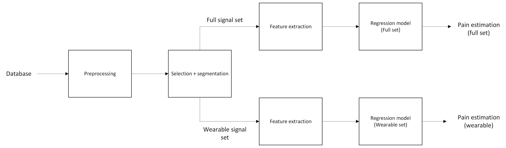

# Pain Estimation from Physiological Signals

Final project for Biosystems Analysis.

This project develops machine learning models to estimate pain intensity using multimodal physiological signals from the PainMonit dataset. The goal is to evaluate whether physiological signals can be used to objectively quantify perceived pain levels.

## Team

- Anton Cobian Iregui
- Sanket Prashant Gavankar
- Zebediah Vincent Parker
- Kevin Morales Romero
- Yavan Vyas

## Project Structure
```
painmonit-pain-estimation/
│
├── data/        
├── notebooks/           
├── src/                 
│   ├── preprocessing.py
│   ├──...
│   
├── proposal/
├── results/             
├── figures/             
├── requirements.txt
└── README.md
```
## Pipeline
The following diagram illustrates the processing pipeline used in this project.


## Reproducibility
To download all needed dependencies:

```cmd 
pip install -r requirements.txt
```
All experiments were conducted using the PainMonit dataset and the code in this repository. The dataset must be downloaded separately and placed in the `data/` folder.

## Disclaimer

This project is for academic purposes only. The PainMonit dataset is not distributed in this repository and must be obtained from its official source. Users must comply with the dataset’s licensing terms.